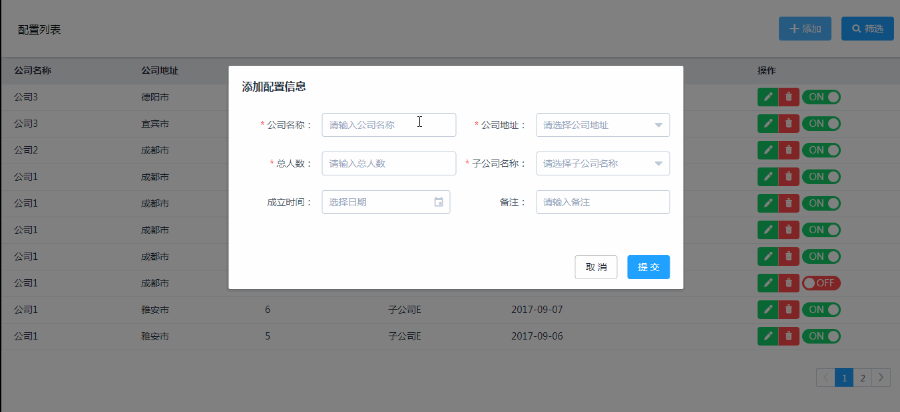

# vue-config-demo
基于vue、vuex、express、mongodb的一个单页应用，包括前后端,前端主要是使用vue,后端是node的express，数据库是使用的mongodb
### 下载
```
git clone https://github.com/rainbowChenhong/vue-config-demo.git
cd vue-config-demo
cd node-server
npm install //安装后端依赖包
cd config-page
npm install //安装前端依赖包
```
### 后端运行
需要先启动mongoDB的服务器，再执行此代码，否则会报错
```
 npm run server (正常启动模式)
 访问 http://localhost:8088
```
### 前端运行
```
 npm run dev (正常编译模式)
 npm run build （发布生产版本，提取公共代码，分离css文件）
 访问 http://localhost:8080
```
### 效果展示

### 注意
1.如果需要上线，则需要把前端编译下，放在和node-server的同级的目录下，
当然也可以自己修改路径。在node-server下面的app.js里面修改即可
```
app.use(express.static(__dirname+"./../static"))
```
2.连接数据库的地址在db文件夹下面的db.js里面修改
```
DB_URL = 'mongodb://localhost:27017/test'
```
3.前端连接设置跨域的地址在webpack.config.js里面的devServer里面修改地址即可
```
 devServer:{
  proxy: {
             '/company/*': {
                 target: 'http://192.168.149.32:8088/',
                 secure: false,
             }
         }
 }
 ```
